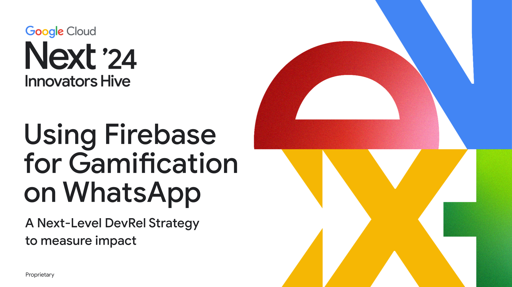

# Using Firebase for Gamification on WhatsApp
## A Next-Level DevRel Strategy to measure impact

Thank you for attending my session at **Google Cloud Next 2024**!

Here are some interesting links and code samples you can check:

* [Main WhatsApp Demo at The Developer's conference](https://github.com/luisleao/twilio_whatsapp_eventos)
* [Building a guessing game using telephone at conferences](https://github.com/luisleao/twilio-game-telefone)
* [Answering phone calls with LLMs and low-code and](https://github.com/luisleao/twilio-openai-voice)
* [Recognizing images using multimodal LLMs and WhatsApp](https://github.com/luisleao/tdcsummitsp-2024)
* [Transcribing phone calls in the browser](https://github.com/luisleao/twilio-telefone-navegador-transcricao)

> Note that some demos are in Portuguese. Please favorite this repository to receive updates about them.

If you have any question or ideas you want to build with Twilio, please contact me at **lleao [at] twilio.com**.

